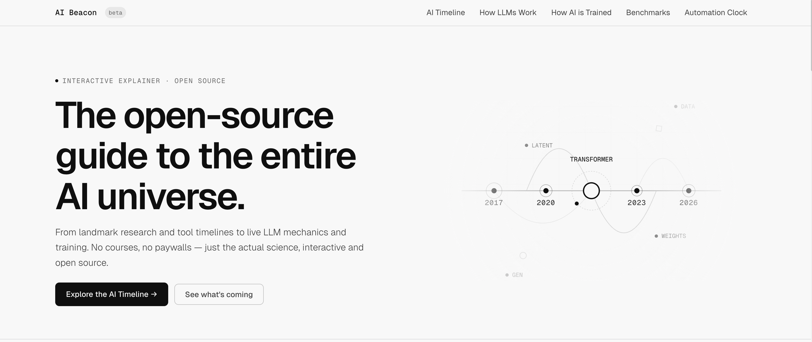
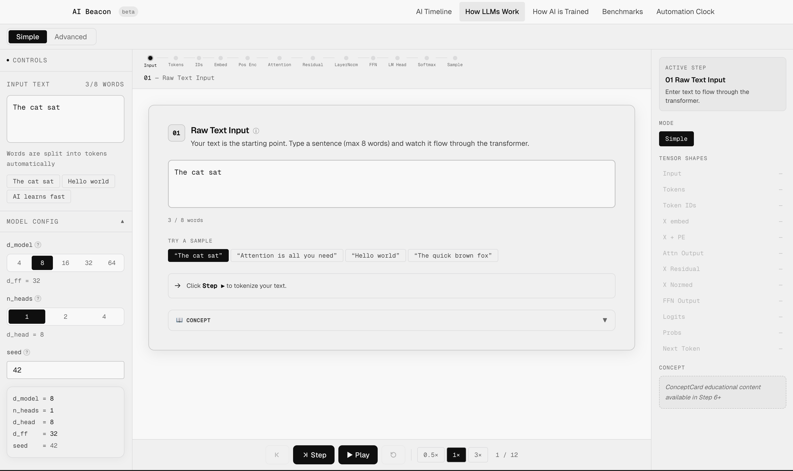
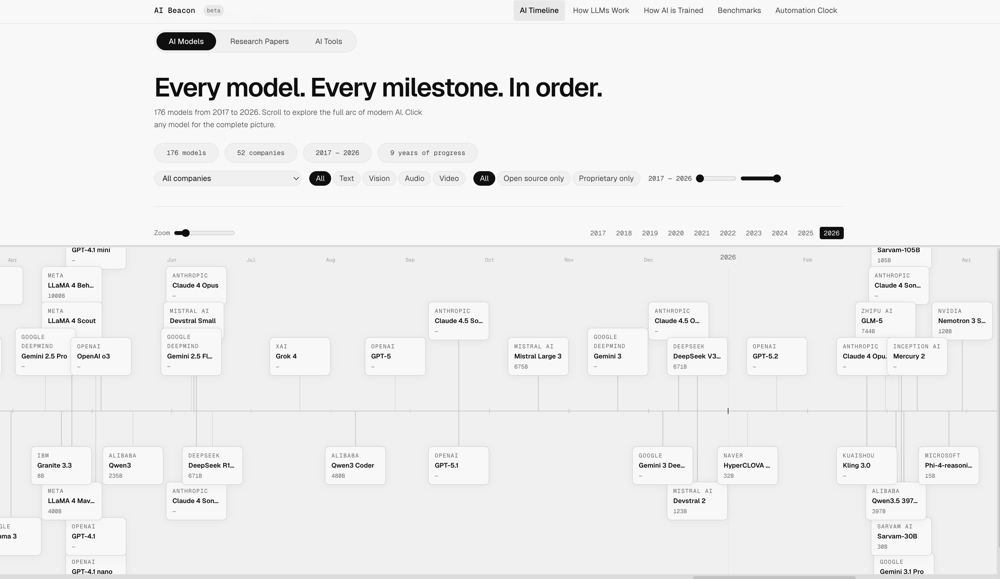

# AI Beacon — LLM Visualizer

**A free, browser-native, zero-backend interactive toolkit for understanding how Large Language Models work.**

[](https://ai-beacon.pages.dev)

---

## What is AI Beacon?

AI Beacon (codename **DEPTH** — *Deep Exploration of Probabilistic Transformer Heuristics*) is an open-source educational platform that demystifies the inner workings of transformer-based LLMs. Instead of passive articles or videos, you **interact**: type your own text, configure toy models, and watch every step—from tokenization to sampling—computed live in the browser with real numbers and clear visualizations.

**Core idea:** Understanding comes from doing. We turn the “black box” into a legible, navigable map.

---

## Why We Built This

The AI revolution is moving fast. There’s no shortage of content about *what* AI can do; there are far fewer resources that clearly show *how* it does it. AI Beacon is our contribution to open-source education: a tool for students, researchers, and the curious to explore the science of the transformer—no GPU, no API key, no installation.

- **No handwaving** — Mathematically honest shapes and operations that match what frameworks like PyTorch do at equivalent dimensions.
- **Zero backend** — Everything runs in the browser; no server, no model weights to download.
- **Bi-modal learning** — Simple mode (visual metaphors) and advanced mode (matrices, shapes, equations) for different audiences.

---

## Features

| Module | Route | Description |
|--------|--------|-------------|
| **Transformer Simulator** | `/transformer-simulator` | Step through a full transformer forward pass: raw text → tokenization → embedding → positional encoding → self-attention → residual → layer norm → FFN → LM head → softmax → sampling. Every step is computed in-browser with a custom math engine; shapes and values are visible. |
| **Training Pipeline** | `/transformer-training-simulator` | 10-step interactive walkthrough of how LLMs are trained: data collection, tokenizer training, architecture design, pre-training, evaluation, SFT, alignment (RLHF, DPO, etc.), benchmarking, inference optimization, deployment. |
| **Timeline** | `/timeline` | Chronological view of LLM releases, research papers, and AI tools. Explore by model family, parameters, context window, and open-source status. |
| **Benchmarks** | `/benchmarks` | Curated leaderboard of frontier and open-weight models with MMLU, HumanEval, GSM8K, Arena ELO, pricing, and speed. Includes value maps, radar comparisons, and source attributions. |
| **Automation Clock** | `/automation-clock` | Sector-by-sector view of AI automation impact over time (software, healthcare, finance, legal, etc.) with milestones and job-impact visualizations. |

---

## Screenshots

Screenshots live in `docs/screenshots/`. Here’s the app at a glance:

| Home | Transformer Simulator | Timeline |
|------|------------------------|----------|
| [](docs/screenshots/AiBeacon-Home.png) | [](docs/screenshots/AiBeacon-Transformer-Simulator.png) | [](docs/screenshots/Ai-Beacon-Timeline.png) |

- **Home** — Hero, module grid, and conceptual timeline.
- **Transformer Simulator** — Step-through LLM forward pass (input, tokens, attention, sampling).
- **Timeline** — Chronological view of AI models, papers, and tools with filters.

---

## Tech Stack

| Layer | Choice |
|-------|--------|
| **Framework** | Vite 6 + React 19 (SPA) |
| **Language** | TypeScript 5+ (strict) |
| **State** | Zustand 5 |
| **Animation** | Framer Motion 11 |
| **Styling** | CSS custom properties (design tokens) + Tailwind 4 |
| **Testing** | Vitest + React Testing Library |
| **Deployment** | Cloudflare Pages (static) |

**Math:** Custom pure-TypeScript tensor and transformer math (no `mathjs`). Toy dimensions only (e.g. `d_model ≤ 64`, `n_tokens ≤ 12`) so everything runs instantly in the browser.

---

## Getting Started

### Prerequisites

- **Node.js** 18+ (recommend 20+)
- **npm** or **pnpm**

### Install and run

```bash
git clone https://github.com/Akashkunwar/AI-Beacon.git
cd AI-Beacon
npm install
npm run dev
```

Open [http://localhost:5173](http://localhost:5173).

### Scripts

| Command | Description |
|---------|-------------|
| `npm run dev` | Start dev server (Vite) |
| `npm run build` | TypeScript check + production build |
| `npm run preview` | Serve production build locally |
| `npm run lint` | Run ESLint |
| `npm run test` | Run Vitest tests |

---

## Project Structure

```text
AI-Beacon/
├── public/                 # Static assets, favicon, robots.txt, sitemap
├── src/
│   ├── components/
│   │   ├── core/           # SimulatorShell, PipelineCanvas, StepRouter
│   │   ├── controls/       # ControlPanel, ModelConfigForm, ModeToggle
│   │   ├── pipeline/       # One component per transformer step (RawInput → Sampling)
│   │   ├── visualizers/    # MatrixHeatmap, VectorBar, AttentionHeatmap, TokenBadge, etc.
│   │   ├── educational/    # TooltipEngine, ConceptCard, OnboardingTour
│   │   ├── training/       # 10-step training walkthrough components
│   │   ├── timeline/       # Timeline canvas, table, popup
│   │   ├── benchmarks/     # Leaderboard, charts, glossary
│   │   ├── automation/     # YearSlider, SectorCard, JobImpactChart, etc.
│   │   ├── shared/         # Nav, Footer, ErrorBoundary, buttons
│   │   └── common/         # SEO, ScrollToTop, SkipToMain
│   ├── config/             # site.ts (baseUrl, GitHub, OG)
│   ├── data/               # JSON datasets, benchmarkData, automationData
│   ├── hooks/              # useReducedMotion, etc.
│   ├── lib/
│   │   ├── mathEngine/     # tensor, matmul, attention, softmax, positional, etc.
│   │   ├── store/          # simulatorStore, stepMachine, types
│   │   └── tokenizer/      # vocab, wordSplit
│   ├── pages/              # One file per route (Home, SimulatorPage, Training, etc.)
│   ├── utils/              # timeline helpers, interpolation
│   ├── tokens.css          # Design tokens (colors, spacing, typography)
│   └── index.css           # Global styles, imports tokens
├── index.html
├── vite.config.ts
├── AI-Beacon-PRD.md        # Product vision, personas, pipeline steps, modules
└── AI-Beacon-Technical-Specs.md   # Code structure, data structures, design tokens
```

---

## Routes

| Path | Page | Purpose |
|------|------|---------|
| `/` | Home | Hero, module grid, automation teaser, pipeline preview |
| `/transformer-simulator` | Simulator | Interactive transformer forward-pass visualizer |
| `/transformer-training-simulator` | Training | 10-step “How LLMs are trained” walkthrough |
| `/timeline` | Timeline | LLM & papers & tools timeline |
| `/benchmarks` | Benchmarks | Model leaderboard, charts, glossary |
| `/automation-clock` | Automation Clock | Sector-wise AI automation impact |
| `/about` | About | Mission, deployment info |
| `*` | NotFound | 404 page |

---

## Documentation (for contributors)

Before changing code, read these so the whole codebase and intent are clear:

| Document | Purpose |
|----------|--------|
| [**AI-Beacon-PRD.md**](./AI-Beacon-PRD.md) | Product vision, target users, pipeline steps, modules, design principles |
| [**AI-Beacon-Technical-Specs.md**](./AI-Beacon-Technical-Specs.md) | Project structure, data structures, component architecture, design tokens |

Design is **minimal monochrome light** (greyscale only in UI). Data visualizations use a separate `--viz-*` token set; see `src/tokens.css`.

---

## Contributing

We welcome contributions that align with the PRD and technical specs.

1. **Fork** the repo and create a branch from `main`.
2. **Read** [AI-Beacon-PRD.md](./AI-Beacon-PRD.md) and [AI-Beacon-Technical-Specs.md](./AI-Beacon-Technical-Specs.md).
3. **Follow** existing patterns: named exports, tokens from `src/tokens.css`, no `any`, functional components, accessibility (keyboard, `aria-*`, `prefers-reduced-motion`).
4. **Test:** run `npm run lint` and `npm run test` before submitting.
5. **Open a PR** with a short description of what changed and why.

If you add a new page or major feature, update this README and the docs above so the next contributor has the full picture.

---

## License

License not yet specified. If you adopt a license (e.g. MIT), add a `LICENSE` file and note it here.

---

## Links

- **Live site:** [https://ai-beacon.pages.dev](https://ai-beacon.pages.dev)
- **Repository:** [https://github.com/Akashkunwar/AI-Beacon](https://github.com/Akashkunwar/AI-Beacon)
