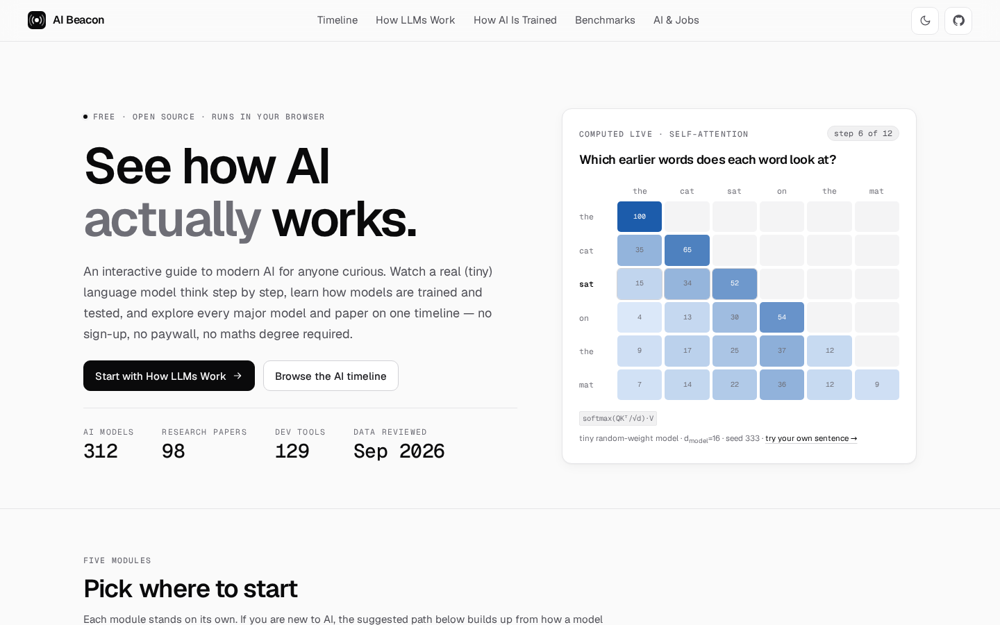
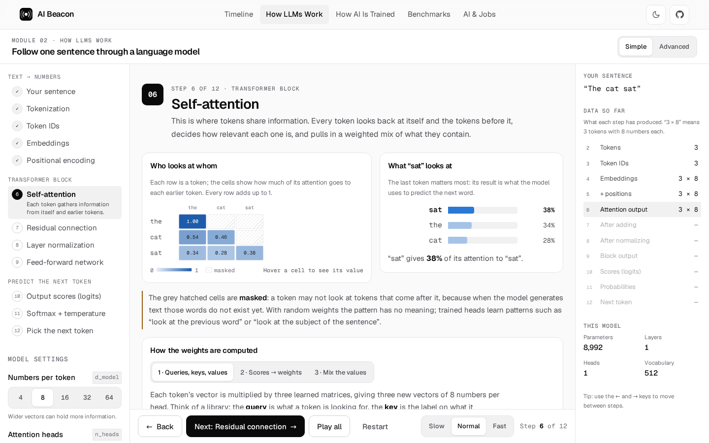
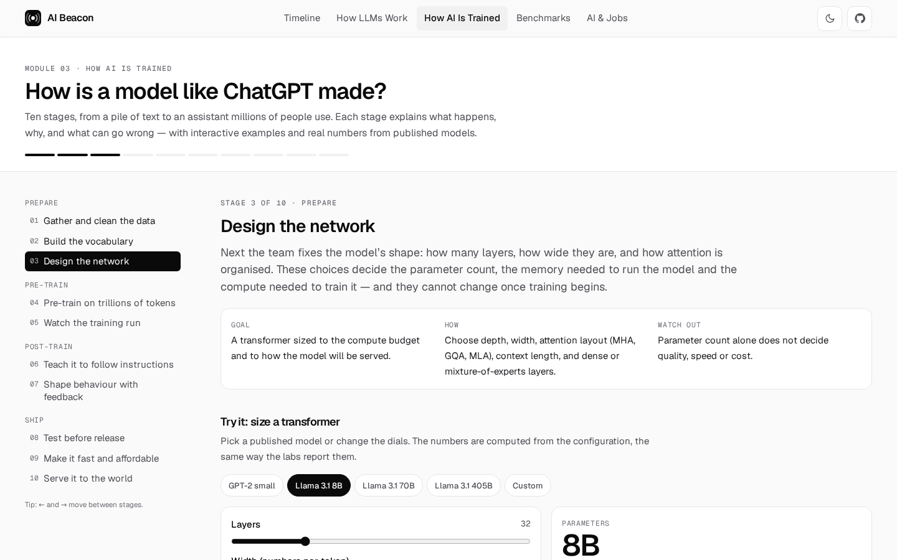
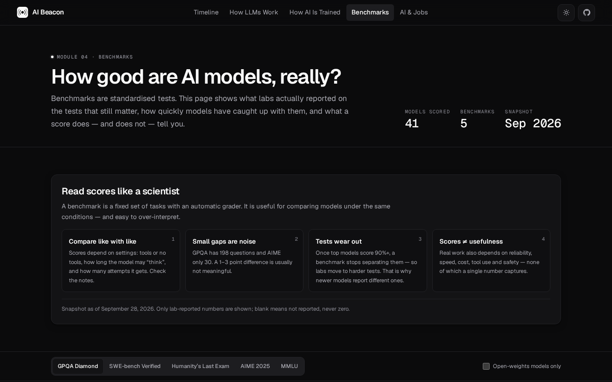
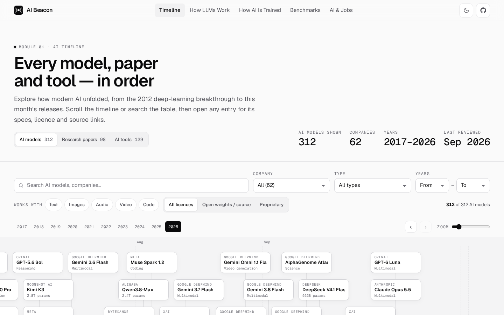

# AI Beacon

**A free, open-source, interactive guide to how modern AI works.**

Watch a real (tiny) language model process your sentence, follow a model from raw data to deployment, compare today's models on sourced benchmarks, explore every major model and paper since 2012, and read what the evidence says about AI and jobs. Everything runs in your browser — no sign-up, no backend, no tracking.

[](https://ai-beacon.pages.dev)
[](./LICENSE)



---

## Modules

| # | Module | Route | What you can do |
|---|---|---|---|
| 01 | **AI Timeline** | `/timeline` | Scroll, zoom and search 312 models, 98 research papers and 129 developer tools. Filter by company, type, modality, licence and year; open any entry for specs and source links. Filters live in the URL, so every view can be shared. |
| 02 | **How LLMs Work** | `/transformer-simulator` | Type a sentence and step through a real transformer forward pass in 12 steps — tokens, embeddings, positional encoding, multi-head causal attention, residuals, layer norm, feed-forward, logits, softmax with temperature, and greedy or top-k sampling — then append the prediction and run it again. *Simple* mode explains in plain language; *Advanced* mode adds tensor shapes, formulas and PyTorch code. |
| 03 | **How AI Is Trained** | `/transformer-training-simulator` | Ten stages from data to deployment, each with an interactive demo: real published data mixes, a byte-pair-encoding run and genuine GPT tokenizations, a transformer sizing calculator, loss and scaling-law explorers, a training-run replay, LoRA, a preference-labelling exercise, a memory calculator, speculative decoding and a request's journey through a serving stack. |
| 04 | **Benchmarks** | `/benchmarks` | Lab-reported scores on GPQA Diamond, SWE-bench Verified, Humanity's Last Exam, AIME and MMLU for 41 models, with price, progress over time, score-versus-price and head-to-head comparison. Every score links to its source; blank means not reported. |
| 05 | **AI Impact Index** | `/automation-clock` | Findings from the ILO, IMF, WEF, Stanford, Anthropic and others on AI and work, why their numbers differ, and a clearly labelled illustrative scenario explorer by sector. |

Also: `/about` (methodology, data review dates, how to contribute) and a 404 page.

| How LLMs Work | How AI Is Trained |
|---|---|
|  |  |
| **Benchmarks (dark theme)** | **AI Timeline** |
|  |  |

## Accuracy

- **Primary sources.** Figures come from the lab's paper, model card or announcement, or the organisation that published a study, and are linked where they appear.
- **Illustrative content is labelled.** The simulator does real maths with random, untrained weights; some training charts show a typical shape; the jobs scenario explorer is an editorial index.
- **Unknown stays blank.** Nothing is estimated to fill gaps.
- **Checked automatically.** `npm test` runs dataset integrity tests (counts, ids, dates, categories, links, review dates) and tests of the maths engine.

Data was last reviewed on **28 September 2026**. See [docs/DATA-GUIDE.md](docs/DATA-GUIDE.md) for the rules, or [open a data correction](https://github.com/Akashkunwar/AI-Beacon/issues/new?template=data_correction.md).

## Getting started

Requires Node.js 20 or newer.

```bash
git clone https://github.com/Akashkunwar/AI-Beacon.git
cd AI-Beacon
npm install
npm run dev        # http://localhost:5173
```

| Command | What it does |
|---|---|
| `npm run dev` | Start the Vite dev server |
| `npm run build` | Type-check and build to `dist/` |
| `npm run preview` | Serve the production build |
| `npm run typecheck` | TypeScript only |
| `npm run lint` | ESLint (TypeScript + React Hooks rules) |
| `npm test` | Vitest: maths engine, simulator store and dataset integrity |
| `npm run check` | Typecheck, lint and tests together — run before opening a pull request |

## Tech stack

| Layer | Choice |
|---|---|
| App | Vite 6, React 19, TypeScript (strict), React Router 7 |
| State | Zustand (simulator) and URL search params (timeline, training stages) |
| Maths | A small pure-TypeScript tensor library in `src/lib/mathEngine` — no ML framework, deterministic seeded weights |
| Styling | Design tokens in `src/tokens.css` with light and dark themes; component-scoped CSS; self-hosted Geist fonts |
| Charts | Hand-written SVG with a colour-blind-checked palette, tooltips and legends |
| Motion | Framer Motion, respecting `prefers-reduced-motion` |
| Tests | Vitest + jsdom |
| Hosting | Static site (Cloudflare Pages; a `vercel.json` is included for Vercel) |

## Project structure

```text
src/
├── pages/                 # One component per route
├── components/
│   ├── shared/            # Nav, Footer, PageHeader, buttons, icons, theme toggle
│   ├── home/              # Hero attention grid
│   ├── timeline/          # Canvas, filters, table, detail dialog
│   ├── core/ controls/    # Simulator shell, step router, settings, playback
│   ├── pipeline/          # The 12 simulator steps + StepKit primitives
│   ├── training/          # The 10 training stages + TrainingKit primitives
│   ├── benchmarks/        # Leaderboard, progress, value, compare, glossary, sources
│   ├── automation/        # AI & jobs scenario explorer
│   ├── charts/            # Shared chart helpers and LineChart
│   └── educational/       # Learning guide, "Go deeper" concept cards
├── config/                # Module registry, site URLs
├── data/                  # Datasets (see docs/DATA-GUIDE.md)
├── lib/
│   ├── mathEngine/        # Tensors, attention, normalisation, sampling…
│   ├── store/             # Simulator step machine and Zustand store
│   └── tokenizer/         # Demo vocabulary and word/punctuation tokenizer
├── hooks/ utils/          # Theme, reduced motion, width; date and number formatting
├── tokens.css             # Design tokens (light + dark)
└── index.css              # Reset and shared component classes
```

More detail: [AI-Beacon-PRD.md](AI-Beacon-PRD.md) (product) and [AI-Beacon-Technical-Specs.md](AI-Beacon-Technical-Specs.md) (architecture, design system, data model).

## Contributing

Corrections and updates are the most valuable contributions — AI moves fast.

1. Fork the repository and branch from `main`.
2. For data changes, follow [docs/DATA-GUIDE.md](docs/DATA-GUIDE.md) and include a primary source for every value.
3. For code, use design tokens rather than raw colours, keep components accessible (keyboard, labels, reduced motion) and check both themes.
4. Run `npm run check` and `npm run build`.
5. Open a pull request describing what changed and why.

## License

[MIT](./LICENSE) © 2026 Akash Kumar and contributors.
